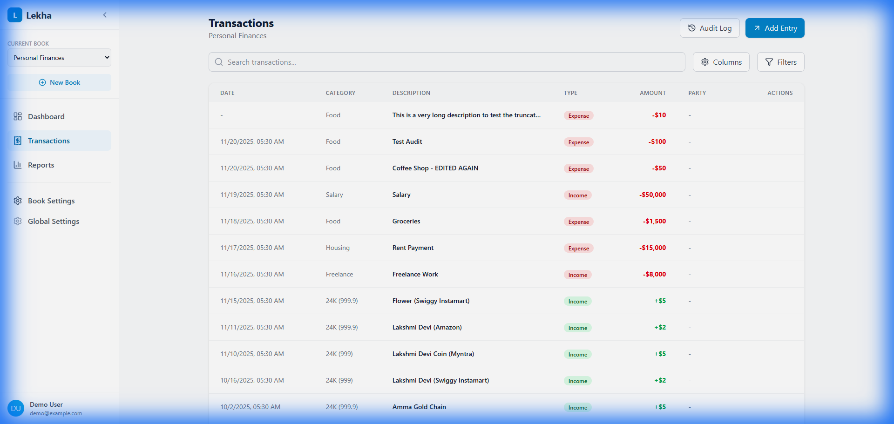
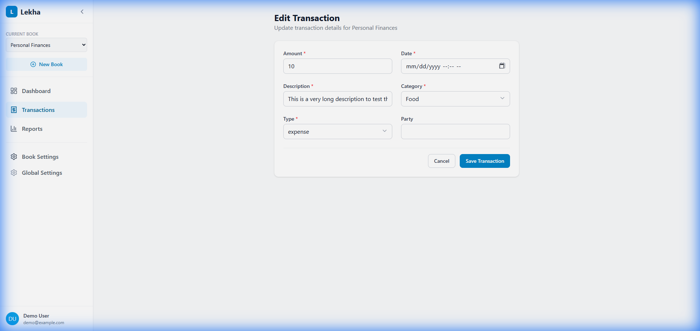
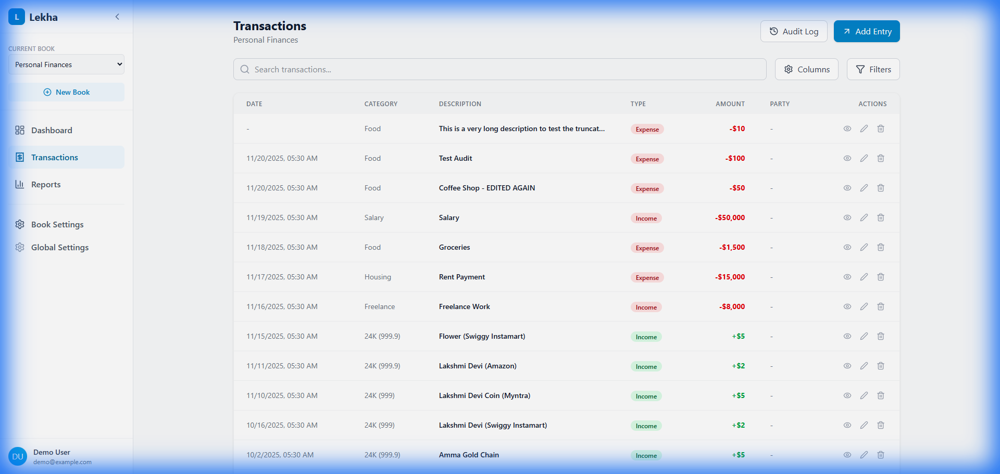

# DEF-002: Edit Transaction Amount Not Saving

## Defect Information

| Field | Value |
|-------|-------|
| **Defect ID** | DEF-002 |
| **Title** | Edit Transaction - Amount field changes do not persist |
| **Severity** | High |
| **Priority** | P1 |
| **Status** | Open - Verification FAILED |
| **Reported By** | Tester 1 |
| **Reported Date** | 2025-11-21 |
| **Assigned To** | Developer Agent |
| **Feature Area** | Transaction Management |

## Environment

- **Application Version/Branch**: tester-branch
- **Browser**: Chrome (via Antigravity browser)
- **Operating System**: Windows
- **Test Environment**: Lekha-Test worktree
- **Dev Server**: http://localhost:5173/lekha/

## Description

When editing an existing transaction, changes made to the **Amount** field are not saved to the database. The Description field and other fields save correctly, but the Amount value reverts to its original value after saving.

This is a critical bug as it prevents users from correcting transaction amounts.

## Preconditions

1. Application is running with at least one existing transaction
2. Navigate to the Transactions page
3. Transaction data is visible in the list

## Steps to Reproduce

1. Navigate to **Transactions** page
2. Note the current **Amount** of any transaction (e.g., $10)
3. Click **Edit** button for that transaction
4. Change the **Amount** field to a different value (e.g., 999)
5. Leave all other fields unchanged
6. Click **Save Transaction** button
7. Observe the transaction in the list

## Expected Result

- The transaction should be saved successfully
- The Amount field should display the new value ($999 in this example)
- The change should persist after page reload

## Actual Result

- The Amount field reverts to its original value ($10)
- No error message is displayed
- The Description field saves correctly if changed
- Other fields appear to save correctly

## Screenshots/Evidence

*Transaction showing original Amount of $10*

*Edit form with Amount changed to 999*

*Transaction list still showing Amount of $10 after save*

**Video Recording**: file:///C:/Users/rajee/.gemini/antigravity/brain/34dd5cb7-35c2-450c-adf6-5f4ccbe73454/edit_amount_verification_1763668775692.webp

## Additional Information

- **Reproducibility**: Always (100% reproducible)
- **Workaround**: None available
- **Related Defects**: DEF-001 (Fixed - Duplicate fields on edit form)
- **Impact**: Users cannot correct transaction amounts, making the application unreliable for financial tracking

## Developer Notes

*Developer to investigate:*
- Check form submission handling in EditTransaction.tsx
- Verify data mapping in handleSubmit function
- Check if Amount field is being excluded from the update
- Review database update logic in db.updateTransaction()

## Verification Notes

**First Test (2025-11-21 00:30)**: FAILED - Bug still present
**Retest (2025-11-21 01:30)**: FAILED - Bug still present after claimed fix
- Changed Amount from 10 to 999
- After save, Amount remained at 10
- Issue confirmed as NOT FIXED

---

## QA Verification (Final)

**Date:** 2025-11-21  
**Tester:** Tester 1  
**Environment:** QA Server (port 4000)  
**Status:** ❌ **VERIFICATION FAILED**

### Test Steps
1. Opened http://localhost:4000/lekha/transactions
2. Created transaction "Persistence Test" with Amount 777
3. Clicked Edit on the transaction
4. Changed Amount field from 777 to 888
5. Scrolled down and clicked Save Transaction
6. Observed result in transaction list
7. Reloaded page to verify persistence

### Expected Result
- Amount should update from 777 to 888
- New amount should persist after page reload

### Actual Result
- Amount field **concatenates instead of replaces**: became **777888** instead of 888
- The incorrect concatenated value (777888) persists after reload
- Data saves successfully, but the wrong value is saved

### Root Cause Analysis
The amount input field is not properly clearing its existing value before accepting new input in edit mode. When the user types a new amount, the digits are appended to the existing value instead of replacing it.

### Evidence
**Video Recording:** file:///C:/Users/rajee/.gemini/antigravity/brain/34dd5cb7-35c2-450c-adf6-5f4ccbe73454/verify_def002_edit_1763740211267.webp

### Recommended Fix
1. Ensure the amount input field's `defaultValues` in react-hook-form is correctly clearing the field
2. Add `onFocus` handler to select all text in the amount field when editing
3. Verify that the input type="number" is properly replacing (not concatenating) values
4. Consider using explicit `setValue` to clear the field before populating with edit data
