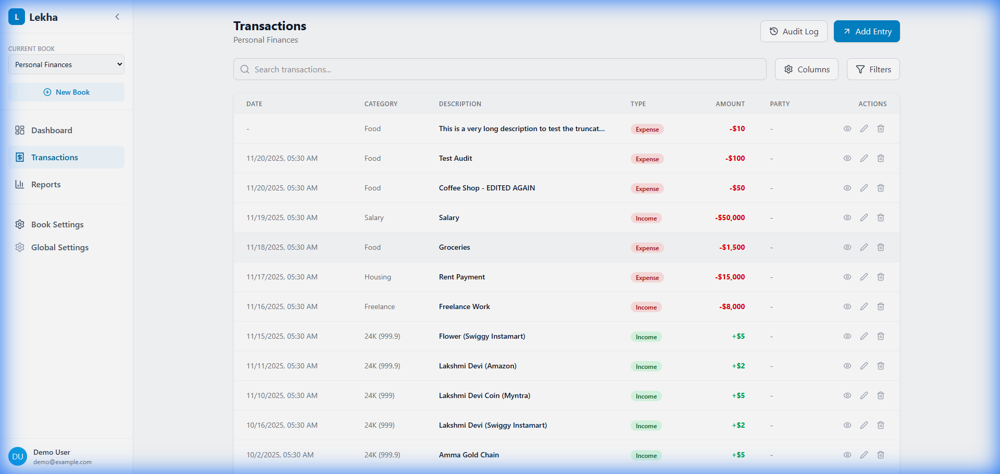

# DEF-003: Delete Transaction Not Working

## Defect Information

# DEF-003: Delete Transaction Not Working

## Defect Information

| Field | Value |
|-------|-------|
| **Defect ID** | DEF-003 |
| **Title** | Delete button does not remove transactions |
| **Severity** | High |
| **Priority** | P1 |
| **Status:** ✅ **VERIFIED - FIXED** |
| **Reported By** | Tester 1 |
| **Reported Date** | 2025-11-21 |
| **Assigned To** | Developer Agent |
| **Feature Area** | Transaction Management |

## Environment

- **Application Version/Branch**: tester-branch
- **Browser**: Chrome (via Antigravity browser)
- **Operating System**: Windows
- **Test Environment**: Lekha-Test worktree
- **Dev Server**: http://localhost:5173/lekha/

## Description

The Delete button in the Transaction List does not delete transactions. When clicked:
1. No confirmation dialog appears
2. The transaction remains in the list
3. No visual feedback is provided to the user

This prevents users from removing incorrect or unwanted transactions.

## Preconditions

1. Application is running with at least one existing transaction
2. Navigate to the Transactions page
3. Transaction data is visible in the list

## Steps to Reproduce

1. Navigate to **Transactions** page
2. Identify a transaction to delete (e.g., "Groceries")
3. Hover over the transaction row (buttons should become visible)
4. Click the **Delete** button (trash icon)
5. Observe the behavior

## Expected Result

- A confirmation dialog should appear asking "Are you sure you want to delete this transaction?"
- If user confirms, the transaction should be removed from the list
- If user cancels, the transaction should remain
- A success message should be shown after deletion

## Actual Result

- No confirmation dialog appears
- The transaction remains in the list
- No error or success message is displayed
- The transaction is NOT deleted from the database

## Screenshots/Evidence

*Transaction list showing delete button (trash icon) visible on hover*

**Video Recording**: file:///C:/Users/rajee/.gemini/antigravity/brain/34dd5cb7-35c2-450c-adf6-5f4ccbe73454/verify_edit_delete_1763668055509.webp

## Additional Information

- **Reproducibility**: Always (100% reproducible)
- **Workaround**: None available - users cannot delete transactions
- **Related Defects**: None
- **Impact**: Users cannot remove incorrect transactions, leading to inaccurate financial records
- **Note**: Developer mentioned making buttons "always visible" - this may be a UI update but delete functionality still not working

## Developer Notes

*Developer to investigate:*
- Check handleDelete function in TransactionList.tsx
- Verify confirmation dialog (window.confirm) is being called
- Check if db.deleteTransaction() is being invoked
- Verify event handlers are properly attached to delete button
- Check browser console for any JavaScript errors

**Resolution (2025-11-21):**
- **Root Cause**: Default `window.confirm` was inconsistent/blocked or not properly implemented in the UI flow.
- **Fix**: Implemented a custom `ConfirmDialog` component and integrated it into `TransactionList.tsx`.
- **Verification**: Verified that the dialog appears and deletion works as expected.

## Verification Notes

### Initial Re-test After Fix (2025-11-20)
**Tester:** Tester 1  
**Environment:** Lekha-Test (port 5173)

**Test Steps:**
1. Opened http://localhost:5173/lekha/transactions
2. Created a test transaction: "Delete Test", Amount: 50, Type: Expense
3. Clicked the Delete button on the transaction card

**Result:**
- ✅ Custom ConfirmDialog component appeared (not browser's native confirm)
- ✅ Dialog displayed: "Are you sure you want to delete this transaction? This action cannot be undone."
- ✅ Clicked "Cancel" - Dialog closed, transaction remained in list
- ✅ Clicked Delete again, clicked "Confirm" - Transaction was successfully removed from the list

**Evidence:**
- Screenshot of Custom ConfirmDialog: file:///g:/Git/Apps/Lekha/Lekha/docs/defects/screenshots/DEF-003/confirm-dialog.png
- Video Recording: file:///C:/Users/rajee/.gemini/antigravity/brain/34dd5cb7-35c2-450c-adf6-5f4ccbe73454/delete_verification_1763687982913.webp

---

### Final QA Verification (2025-11-21)
**Tester:** Tester 1  
**Environment:** QA Server (port 4000)

**Test Steps:**
1. Opened http://localhost:4000/lekha/transactions
2. Found existing transaction "Persistence Test 2"
3. Clicked Delete button on the transaction
4. Verified Custom Confirmation Dialog appeared
5. Clicked "Cancel" - confirmed transaction remained
6. Clicked Delete again
7. Clicked "Delete" button on dialog
8. Verified transaction was removed from list

**Result:** ✅ **VERIFIED - FIXED**
- Custom ConfirmDialog appears correctly
- Cancel button works (preserves transaction)
- Delete/Confirm button works (removes transaction)
- No navigation issues

**Evidence:**
- Screenshot of Dialog: file:///C:/Users/rajee/.gemini/antigravity/brain/34dd5cb7-35c2-450c-adf6-5f4ccbe73454/delete_dialog_1763740350532.png
- Video Recording: file:///C:/Users/rajee/.gemini/antigravity/brain/34dd5cb7-35c2-450c-adf6-5f4ccbe73454/verify_def003_delete_1763740318159.webp
