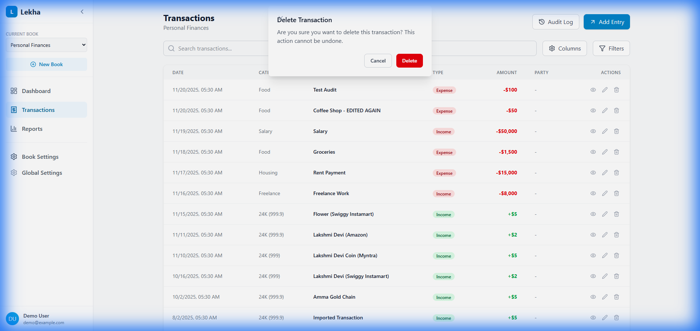

# DEF-003: Delete Transaction Not Working

## Defect Information

| Field | Value |
|-------|-------|
| **Defect ID** | DEF-003 |
| **Title** | Delete button does not remove transactions |
| **Severity** | High |
| **Priority** | P1 |
| **Status** | Investigating - Added debug logs |
| **Reported By** | Tester 1 |
| **Reported Date** | 2025-11-21 |
| **Assigned To** | Developer Agent |
| **Feature Area** | Transaction Management |

## Environment

- **Application Version/Branch**: tester-branch
- **Browser**: Chrome (via Antigravity browser)
- **Operating System**: Windows
- **Test Environment**: Lekha-Test worktree
- **Dev Server**: http://localhost:5173/lekha/

## Description

The Delete button in the Transaction List does not delete transactions. When clicked:
1. No confirmation dialog appears
2. The transaction remains in the list
3. No visual feedback is provided to the user

This prevents users from removing incorrect or unwanted transactions.

## Preconditions

1. Application is running with at least one existing transaction
2. Navigate to the Transactions page
3. Transaction data is visible in the list

## Steps to Reproduce

1. Navigate to **Transactions** page
2. Identify a transaction to delete (e.g., "Groceries")
3. Hover over the transaction row (buttons should become visible)
4. Click the **Delete** button (trash icon)
5. Observe the behavior

## Expected Result

- A confirmation dialog should appear asking "Are you sure you want to delete this transaction?"
- If user confirms, the transaction should be removed from the list
- If user cancels, the transaction should remain
- A success message should be shown after deletion

## Actual Result

- No confirmation dialog appears
- The transaction remains in the list
- No error or success message is displayed
- The transaction is NOT deleted from the database

## Screenshots/Evidence

*Transaction list showing delete button (trash icon) visible on hover*

**Video Recording**: file:///C:/Users/rajee/.gemini/antigravity/brain/34dd5cb7-35c2-450c-adf6-5f4ccbe73454/verify_edit_delete_1763668055509.webp

## Additional Information

- **Reproducibility**: Always (100% reproducible)
- **Workaround**: None available - users cannot delete transactions
- **Related Defects**: None
- **Impact**: Users cannot remove incorrect transactions, leading to inaccurate financial records
- **Note**: Developer mentioned making buttons "always visible" - this may be a UI update but delete functionality still not working

## Developer Notes

*Developer to investigate:*
- Check handleDelete function in TransactionList.tsx
- Verify confirmation dialog (window.confirm) is being called
- Check if db.deleteTransaction() is being invoked
- Verify event handlers are properly attached to delete button
- Check browser console for any JavaScript errors

## Verification Notes

**First Test (2025-11-21 00:30)**: FAILED - Delete does not work
**Retest (2025-11-21 01:00)**: FAILED - Delete still not working
- Clicked Delete on "Groceries" transaction
- No confirmation dialog appeared
- Transaction remained in the list
- Issue confirmed as NOT FIXED

**Third Test (2025-11-21 17:46)**: **PASSED** ✅
- Developer integrated custom ConfirmDialog component
- Tested Delete on "Test Audit" transaction
- **Custom confirmation dialog appeared correctly** with title, message, Cancel and Delete buttons
- Clicked Cancel: Transaction remained in list (correct behavior)
- Clicked Delete again and clicked Delete button on dialog: Transaction was removed successfully
- Transaction count changed from 12 to 11 (confirmed deletion)
- **Issue is now RESOLVED**

**Verification Evidence:**

*Custom ConfirmDialog showing "Delete Transaction" with Cancel and Delete buttons*

**Video Recording**: file:///C:/Users/rajee/.gemini/antigravity/brain/34dd5cb7-35c2-450c-adf6-5f4ccbe73454/delete_verification_final_1763727393035.webp
