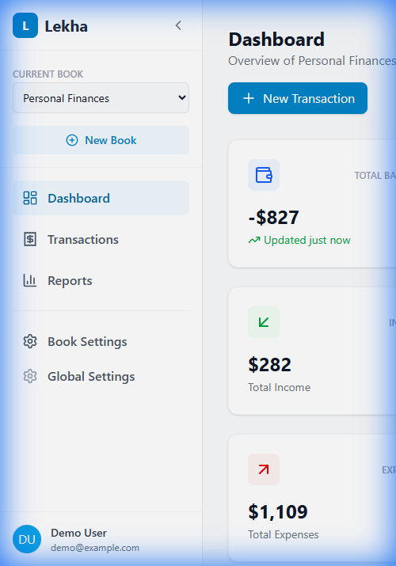
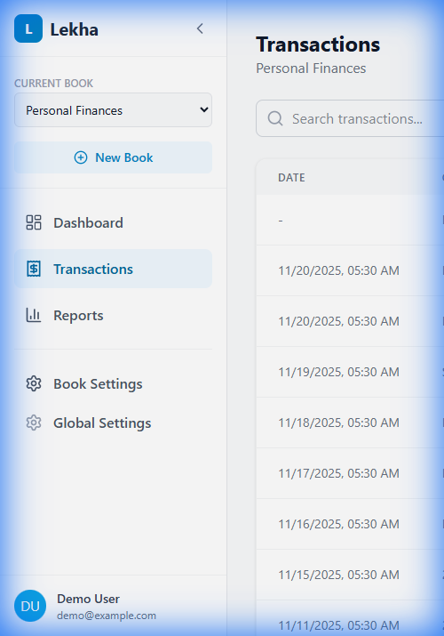
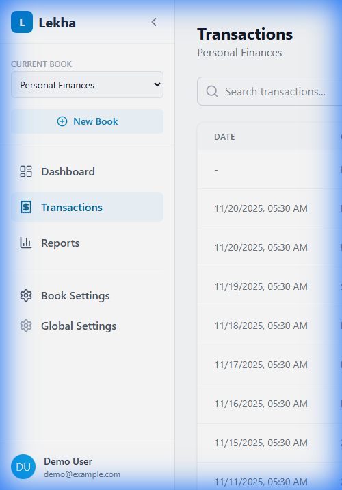
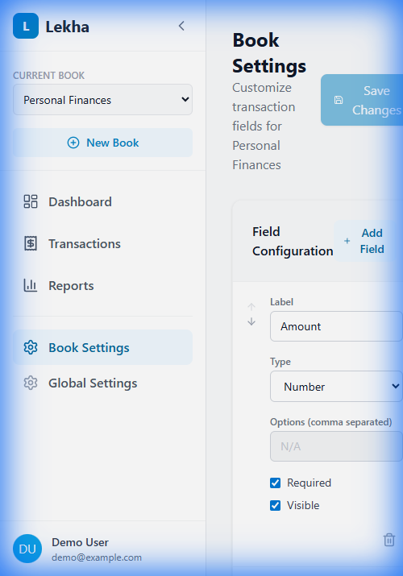
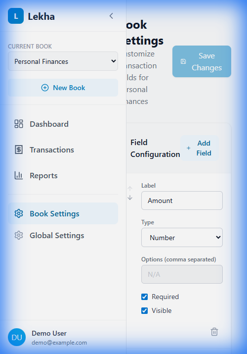

# DEF-004: Mobile UI Not Responsive - Sidebar Always Visible

## Defect Information

| Field | Value |
|-------|-------|
| **Defect ID** | DEF-004 |
| **Title** | Application unusable in mobile portrait mode - sidebar does not collapse |
| **Severity** | High |
| **Priority** | P1 |
| **Status** | Open |
| **Reported By** | Tester 1 |
| **Reported Date** | 2025-11-21 |
| **Assigned To** | Developer Agent |
| **Feature Area** | UI/UX - Responsive Design |

## Environment

- **Application Version/Branch**: tester-branch
- **Browser**: Chrome (via Antigravity browser)
- **Operating System**: Windows
- **Test Environment**: Lekha-Test worktree
- **Dev Server**: http://localhost:5173/lekha/
- **Test Device**: iPhone 12 Pro simulation (390px x 844px portrait)

## Description

The application is not usable in mobile portrait mode (tested at 390px width). The main issues are:

1. **Sidebar does not collapse** - The sidebar remains fixed and visible, taking up ~40% of screen width
2. **Content pushed off-screen** - Main content is pushed to the right and partially hidden
3. **Horizontal scrolling required** - Users must scroll horizontally to view full content
4. **No hamburger menu** - There is no visible button to collapse/hide the sidebar
5. **Poor mobile UX** - The application appears to have no responsive design for mobile devices

This makes the application essentially unusable on mobile phones, which is critical for a financial tracking app that users need to access on-the-go.

## Preconditions

1. Application is running
2. Browser window is resized to mobile portrait dimensions (390px x 844px)

## Steps to Reproduce

1. Open http://localhost:5173/lekha/ in browser
2. Resize browser window to **390px width x 844px height** (iPhone 12 Pro portrait mode)
3. Observe the Dashboard page
4. Navigate to **Transactions** page
5. Navigate to **Reports** page
6. Navigate to **Book Settings** page
7. Try to interact with content on each page
8. Look for a button/icon to collapse the sidebar

## Expected Result

**For Mobile Devices (< 768px width):**
- Sidebar should be hidden by default
- A hamburger menu icon (☰) should be visible in the header
- Clicking the hamburger menu should slide the sidebar in/out
- Main content should use full screen width when sidebar is hidden
- No horizontal scrolling should be required
- All functionality should be accessible without horizontal scrolling

## Actual Result

- Sidebar is always visible and cannot be hidden
- Sidebar occupies ~150px of a 390px screen (~38% of width)
- Main content is squashed into remaining ~240px
- Horizontal scrolling is required on most pages to view content
- No hamburger menu or collapse button is visible
- Transaction list columns are cut off
- Book Settings fields require horizontal scrolling
- Dashboard stats are partially hidden
- Overall UI is cramped and difficult to use

## Screenshots/Evidence

### Dashboard - Mobile View

*Dashboard page at 390px width - sidebar takes up large portion of screen, content partially hidden*

### Transactions - Mobile View

*Transaction list squashed, requires horizontal scrolling to see all columns*

### Reports - Mobile View

*Reports page with sidebar visible, main content pushed off-screen*

### Book Settings - Mobile View

*Book Settings page cramped, field configuration partially hidden*

### Book Settings - Horizontal Scroll

*After scrolling right to see hidden content - poor UX*

**Video Recording**: file:///C:/Users/rajee/.gemini/antigravity/brain/34dd5cb7-35c2-450c-adf6-5f4ccbe73454/mobile_responsiveness_test_1763670351791.webp

## Additional Information

- **Reproducibility**: Always (100% reproducible on all mobile viewport sizes)
- **Workaround**: Use desktop/landscape mode only (not acceptable for mobile app)
- **Related Defects**: None
- **Impact**: **CRITICAL** - Application is unusable on mobile devices
  - Users cannot track transactions on-the-go
  - Poor user experience drives users away
  - Mobile users are a key demographic for financial apps

## Recommended Solution

Implement responsive design with the following:

1. **Hamburger Menu**: Add a ☰ button in the header for mobile views
2. **Collapsible Sidebar**: Sidebar should be hidden by default on mobile (<768px)
3. **Slide-Out Navigation**: Clicking hamburger menu slides sidebar in from left
4. **Full Width Content**: Main content should use full width when sidebar is hidden
5. **Responsive Breakpoints**:
   - Desktop (≥1024px): Sidebar always visible
   - Tablet (768px-1023px): Collapsible sidebar
   - Mobile (<768px): Hidden sidebar with hamburger menu
6. **Touch-Friendly UI**: Increase button sizes for mobile touch interaction
7. **Responsive Tables**: Make transaction table scrollable or use card layout on mobile

## Developer Notes

*Files to investigate:*
- Layout component (likely src/components/Layout/Layout.tsx or Sidebar.tsx)
- CSS/Tailwind media queries for sidebar visibility
- Add hamburger menu component
- Implement sidebar state management (open/closed)
- Add responsive breakpoints using Tailwind's md:, lg: prefixes

## Verification Notes

**Test Date**: 2025-11-21
**Tested Viewports**:
- iPhone 12 Pro Portrait (390x844): FAILED - Sidebar always visible
- Expected mobile UX improvements after fix
