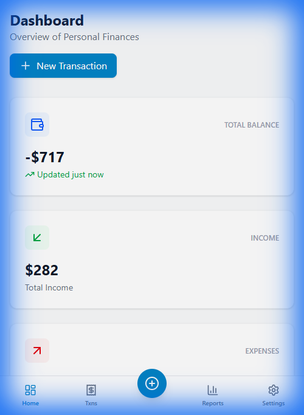
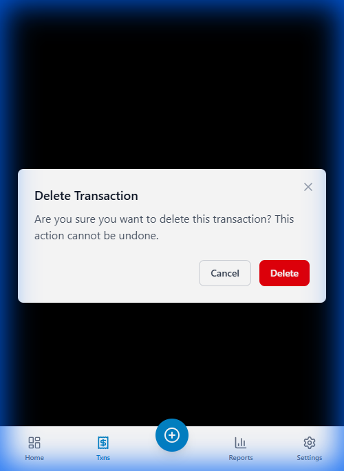

# DEF-005: Dashboard Navigation & Action Issues

## Defect Information

| Field | Value |
|-------|-------|
| **Defect ID** | DEF-005 |
| **Title** | Dashboard "New Transaction" and Floating Add buttons navigate incorrectly |
| **Severity** | High |
| **Priority** | P2 |
| **Status** | Cannot Reproduce - Testing in Progress |
| **Reported By** | Tester 1 |
| **Reported Date** | 2025-11-21 |
| **Assigned To** | Developer Agent |
| **Feature Area** | Dashboard |

## Environment

- **Application Version/Branch**: tester-branch
- **Browser**: Chrome (via Antigravity browser)
- **Operating System**: Windows
- **Test Environment**: Lekha-Test worktree
- **Dev Server**: http://localhost:5173/lekha/

## Description

There are multiple issues with the "Add Transaction" actions on the Dashboard:

1. **Incorrect Navigation**: Both the "New Transaction" button (top right) and the floating "+" button (bottom right) navigate to the **Transaction List** (`/transactions`) instead of the **Create Transaction** page (`/transactions/new`).
2. **Unexpected Behavior**: Clicking the floating "+" button navigates to the Transaction List and immediately triggers a **Delete Confirmation Dialog**, which is potentially dangerous and confusing.
3. **Missing Feature**: The "Quick Actions" section (Add Income / Add Expense buttons) mentioned in requirements is missing from the Dashboard.

## Preconditions

1. Application is running
2. Navigate to Dashboard (`/lekha/`)

## Steps to Reproduce

1. Open Dashboard
2. Click "New Transaction" button in top right corner -> Observe it goes to Transaction List
3. Go back to Dashboard
4. Click floating "+" button in bottom right corner -> Observe it goes to Transaction List and opens Delete Dialog

## Expected Result

- "New Transaction" button should navigate to `/transactions/new`
- Floating "+" button should navigate to `/transactions/new`
- "Quick Actions" section should be visible with specific Income/Expense options

## Actual Result

- Buttons navigate to `/transactions`
- Floating button triggers Delete Dialog
- Quick Actions section is missing

## Screenshots/Evidence

*Dashboard showing "New Transaction" button*

*Result of clicking floating "+" button: Redirects to list and opens Delete Dialog*

**Video Recording**: file:///C:/Users/rajee/.gemini/antigravity/brain/34dd5cb7-35c2-450c-adf6-5f4ccbe73454/dashboard_test_1763729340896.webp

## Additional Information

- **Reproducibility**: Always
- **Impact**: Users cannot easily create transactions from the Dashboard. The delete dialog appearing is a significant UX bug.

## Developer Notes

**Date**: 2025-11-21
**Developer**: AI Agent
**Status Update**: Cannot Reproduce

### Investigation:
1. **Code Review**: Examined `src/components/Dashboard/Dashboard.tsx` (lines 96-102)
   - The "New Transaction" button correctly uses `<Link to="/transactions/new">` 
   - No floating "+" button exists in the Dashboard component
   - Code is identical in both `main` and `tester-branch`

2. **QA Environment Testing**: 
   - Tested on QA server (http://localhost:4000)
   - Clicked "New Transaction" button on Dashboard
   - **Result**: Successfully navigated to `/transactions/new` (Create Transaction form)
   - **Screenshot Evidence**: 
     - Before: `qa_dashboard_before_click_1763746281994.png`
     - After: `qa_after_click_1763746305426.png`
   - **Video Evidence**: `verify_def005_qa_1763746261724.webp`

### Conclusion:
The reported issue **cannot be reproduced** in the current QA environment. The "New Transaction" button functions correctly. 

**Possible explanations:**
1. Issue was fixed inadvertently by recent code changes
2. Testing error or confusion with a different environment
3. Issue specific to a particular browser state/cache that has since been cleared

### Recommendation:
- Mark as "Cannot Reproduce"
- Request QA to retest and provide updated evidence if issue persists
- Close if QA confirms fix

**Note**: No floating "+" button was found in Dashboard. The mobile Bottom Navigation has a "+" button that correctly navigates to `/transactions/new`.
